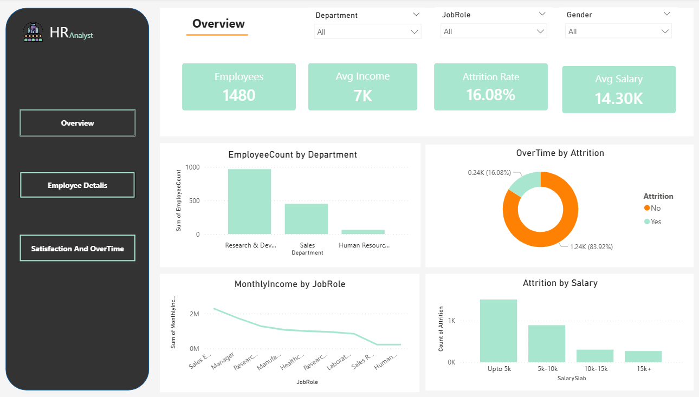
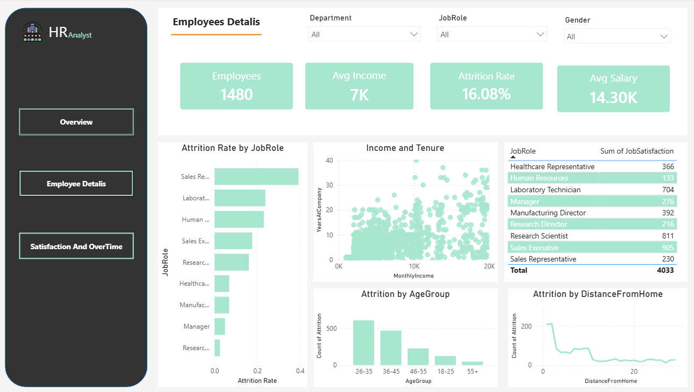
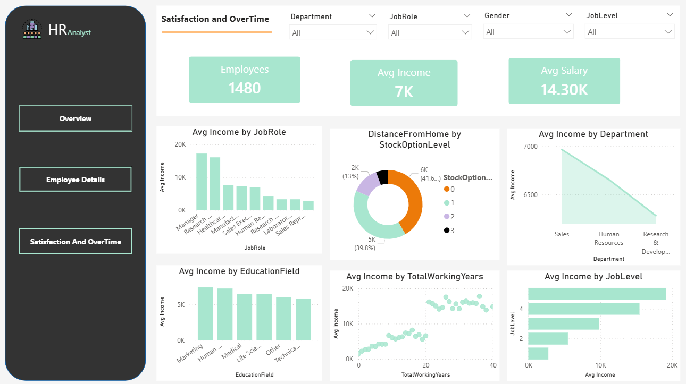

# HR Analytics Dashboard

Interactive HR dashboard built in Power BI for analyzing workforce data and supporting data-driven HR decisions.

## 📊 Project Overview
This dashboard provides a clear view of HR metrics across recruitment, employee performance, attrition, and demographics. It’s split into 3 pages with navigation buttons for easy exploration.

## 📁 Files Included
- **HR_Analytics_Dashboard.pbix**: The main Power BI file.
- **Page1_Screenshot.png**: Overview / KPI page
- **Page2_Screenshot.png**: Employee Analysis page  
- **Page3_Screenshot.png**: Recruitment & Attrition page

## 🔑 Key Features
1. **Navigation System**: Page navigation buttons with Ctrl+Click interaction for smooth movement between pages.
2. **KPI Cards**: Key metrics like Headcount, Turnover Rate, Avg. Tenure, and Open Positions.
3. **Visual Analysis**: Charts for department distribution, hiring trends, attrition reasons, and performance ratings.
4. **Filters & Slicers**: Filter data by department, job role, location, and date range.

## 🛠️ Tools & Tech
- **Power BI Desktop**
- **DAX** for calculated measures
- **Power Query** for data cleaning

## 📸 Dashboard Preview

### Page 1 - Overview

### Page 2 - Employee Analysis  

### Page 3 - Recruitment & Attrition

## 👩‍💻 Author
Shrouk Soliyman 
HR Analytics & Data Visualization Project
